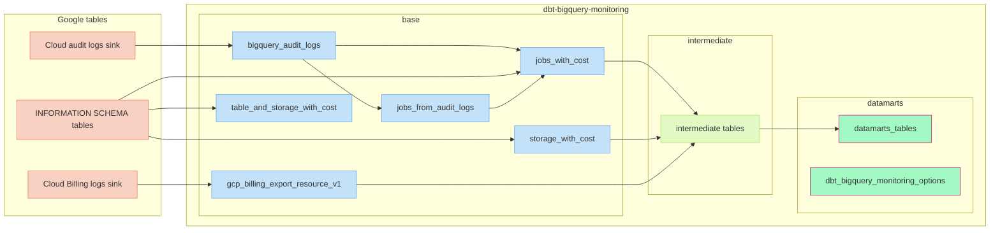

This package aims to bring an easy way to:
- Access INFORMATION SCHEMA tables
- Bridge different INFORMATION SCHEMA tables, audit logs and billing logs together
- Create high level datamarts for queries and asset monitoring

# High level overview

