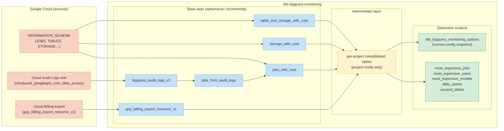

# Architecture

`dbt-bigquery-monitoring` is a dbt package that ingests raw BigQuery metadata from multiple
GCP sources and transforms it into business-ready monitoring tables.

## Data flow

---

## Layer descriptions

### Base layer

Raw data ingestion and standardization. Each model corresponds to one GCP source:

| Model | Source | Description |
|---|---|---|
| `bigquery_audit_logs_v2` | Cloud Audit Logs | Raw v2 audit log events (jobs, table changes, etc.) |
| `jobs_from_audit_logs` | ↑ | Extracts structured job records from audit log events |
| `gcp_billing_export_resource_v1` | Cloud Billing export | Detailed SKU-level billing records |
| `jobs_with_cost` | IS + Audit logs | **Central model** — unified job view with cost attribution |
| `storage_with_cost` | INFORMATION_SCHEMA | Table storage metrics with storage cost |
| `table_and_storage_with_cost` | INFORMATION_SCHEMA | Per-table storage with billing model details |

### Intermediate layer

In **project mode**, INFORMATION_SCHEMA tables cannot be queried across projects in a single
BigQuery job. The intermediate layer materializes results project-by-project using the
`project_by_project_table` custom materialization, then consolidates them into unified tables.

In **region mode**, this layer is ephemeral — models resolve directly as subqueries.

### Datamarts

High-level, business-ready output tables designed for direct BI tool consumption or ad-hoc queries.
See [Using the package](/using-the-package) and [Monitoring Datamarts](/datamarts) for details.

---

## Materialization strategy

| Layer | Region mode | Project mode |
|---|---|---|
| INFORMATION_SCHEMA wrappers | `ephemeral` | `incremental` (per project) |
| Base models | `ephemeral` | `ephemeral` |
| `jobs_with_cost` | `incremental` | `incremental` |
| Datamarts | `table` (configurable) | `table` (configurable) |

The `output_materialization` variable controls the datamart materialization type
(see [package settings](/configuration/package-settings)).
