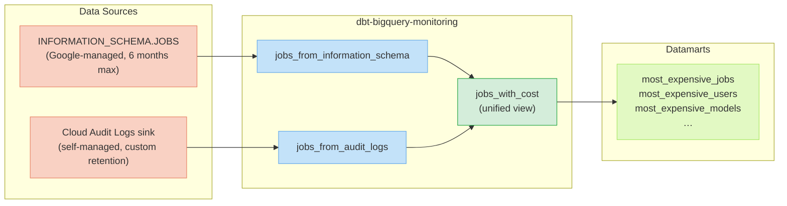

# Audit logs vs Information Schema

dbt-bigquery-monitoring can read BigQuery job data from two sources. You can use either or both.

## How the data flows



Set `should_combine_audit_logs_and_information_schema: true` in `dbt_project.yml` to merge
both sources into the unified `jobs_with_cost` model.

---

## Comparison

| Feature | Audit logs | INFORMATION_SCHEMA |
|---|---|---|
| **Retention** | User-defined (no built-in limit) | Up to 6 months |
| **Detailed user info** (IP, user agent) | ✅ | ❌ |
| **Column-level access tracking** | ✅ | ❌ |
| **BI Engine details** | ❌ | ✅ |
| **Job insights** (spillage, slot contention) | ❌ | ✅ |
| **Near real-time** | ✅ (streaming export) | ✅ |
| **Setup required** | Yes (log sink to BigQuery) | No |
| **Cross-project** | Yes (aggregated sink) | Yes (with project mode) |

---

## Option 1 — INFORMATION_SCHEMA (default, zero setup)

The package reads `INFORMATION_SCHEMA.JOBS` by default. No extra GCP setup is required.

**Best for:** teams that don't need long retention or column-level user access data.

The region or project variables you set determine which projects are monitored:

```yml
# dbt_project.yml
vars:
  bq_region: 'us'   # or use input_gcp_projects for project mode
```

---

## Option 2 — Audit logs (rich history, flexible retention)

BigQuery writes `JobChange` and `JobInsertion` events to Cloud Logging. You export those logs
to a BigQuery dataset via a log sink. The package then reads from that dataset.

**Best for:** teams that need >6 months of history, detailed user tracking, or column-level access logs.

See the [Audit logs configuration guide](/configuration/audit-logs) for full setup instructions.

```yml
# dbt_project.yml
vars:
  enable_gcp_bigquery_audit_logs: true
  gcp_bigquery_audit_logs_storage_project: 'my-log-project'
  gcp_bigquery_audit_logs_dataset: 'my_audit_logs_dataset'
  gcp_bigquery_audit_logs_table: 'cloudaudit_googleapis_com_data_access'
```

---

## Option 3 — Both sources combined (recommended for full coverage)

Enable both and let the package merge them. Jobs found in only one source are still included.

```yml
# dbt_project.yml
vars:
  enable_gcp_bigquery_audit_logs: true
  gcp_bigquery_audit_logs_storage_project: 'my-log-project'
  gcp_bigquery_audit_logs_dataset: 'my_audit_logs_dataset'
  gcp_bigquery_audit_logs_table: 'cloudaudit_googleapis_com_data_access'
  should_combine_audit_logs_and_information_schema: true   # ← merge both
```

This gives you the BI Engine details from INFORMATION_SCHEMA **and** the rich user data from
audit logs, unified in a single `jobs_with_cost` model.
