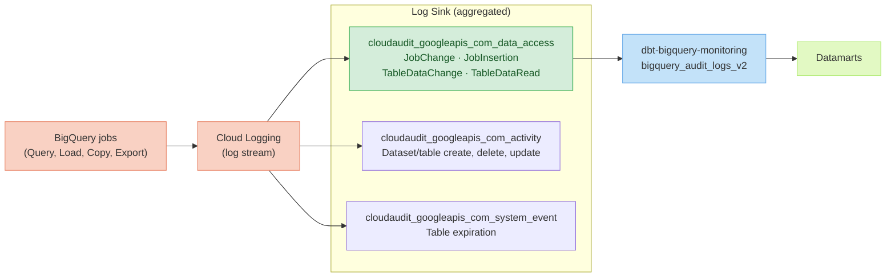

# GCP BigQuery audit logs

In this mode, the package monitors BigQuery job events written to a Cloud Logging export in BigQuery,
instead of (or in addition to) `INFORMATION_SCHEMA.JOBS`.

Not sure which to use? See the [audit logs vs Information Schema](/audit-logs-vs-information-schema) comparison.

:::tip

For maximum coverage, enable **both** audit logs and INFORMATION_SCHEMA by setting
`should_combine_audit_logs_and_information_schema: true`. Audit logs give you long retention
and column-level user tracking; INFORMATION_SCHEMA gives you BI Engine details and job insights.

:::

---

## How audit log export works



---

## Which table to use

When you export BigQuery audit logs to BigQuery via a log sink, GCP creates separate tables per log stream:

| Table | Log stream | Events | Use for |
|---|---|---|---|
| `cloudaudit_googleapis_com_data_access` | Data access | `JobChange`, `JobInsertion`, `TableDataChange`, `TableDataRead` | **Job monitoring** ✅ |
| `cloudaudit_googleapis_com_activity` | Admin activity | Dataset/table create, delete, patch | Admin event tracking |
| `cloudaudit_googleapis_com_system_event` | System event | Table expiration deletions | Table lifecycle tracking |
| `cloudaudit_googleapis_com_policy` | Policy denied | Denied access events | Security auditing |

**Use `cloudaudit_googleapis_com_data_access`** — this is where BigQuery query and load jobs are recorded.

:::note

dbt-bigquery-monitoring **supports only the v2 (BigQueryAuditMetadata) format** of audit logs.
See [the Google BigQuery utils repository](https://github.com/GoogleCloudPlatform/bigquery-utils/tree/master/views/audit)
for details on the v1 vs v2 distinction.

:::

---

## Step 1 — Set up a log sink in GCP

Create an aggregated sink to export audit logs to BigQuery:

```bash
# Create an aggregated sink at the organization level
gcloud logging sinks create bq-audit-logs-sink \
  bigquery.googleapis.com/projects/MY_LOG_PROJECT/datasets/MY_AUDIT_DATASET \
  --organization=MY_ORG_ID \
  --include-children \
  --log-filter='protoPayload.serviceName="bigquery.googleapis.com"'
```

Or use the [GCP Console](https://console.cloud.google.com/logs/router) to create the sink manually:

1. Go to **Logging → Log Router → Create Sink**
2. Set the sink destination to **BigQuery dataset**
3. Use the filter: `protoPayload.serviceName="bigquery.googleapis.com"`
4. Enable **aggregated sink** to capture logs from all projects in your org

After creation, grant the sink's service account **BigQuery Data Editor** access on the destination dataset.

:::tip

Use **partitioned tables** (not date-sharded) when creating the sink — it's the recommended
approach for easier querying and better performance. Set a partition expiration to control
storage costs.

:::

---

## Step 2 — Configure the package

Add the following to `dbt_project.yml`:

```yml
# dbt_project.yml
vars:
  enable_gcp_bigquery_audit_logs: true
  gcp_bigquery_audit_logs_storage_project: 'my-log-project'      # project holding the exported dataset
  gcp_bigquery_audit_logs_dataset: 'my_audit_logs_dataset'       # dataset where logs land
  gcp_bigquery_audit_logs_table: 'cloudaudit_googleapis_com_data_access'  # default for job monitoring

  # Optional: combine with INFORMATION_SCHEMA for full coverage
  # should_combine_audit_logs_and_information_schema: true
```

Or set them as environment variables:

```bash
export DBT_BQ_MONITORING_GCP_BIGQUERY_AUDIT_LOGS="true"
export DBT_BQ_MONITORING_GCP_BIGQUERY_AUDIT_LOGS_STORAGE_PROJECT="my-log-project"
export DBT_BQ_MONITORING_GCP_BIGQUERY_AUDIT_LOGS_DATASET="my_audit_logs_dataset"
export DBT_BQ_MONITORING_GCP_BIGQUERY_AUDIT_LOGS_TABLE="cloudaudit_googleapis_com_data_access"
```

---

## Variables reference

| Variable | Environment Variable | Description | Default |
|---|---|---|---|
| `enable_gcp_bigquery_audit_logs` | `DBT_BQ_MONITORING_GCP_BIGQUERY_AUDIT_LOGS` | Toggle audit logs integration | `false` |
| `gcp_bigquery_audit_logs_storage_project` | `DBT_BQ_MONITORING_GCP_BIGQUERY_AUDIT_LOGS_STORAGE_PROJECT` | Project holding the audit logs dataset | required if enabled |
| `gcp_bigquery_audit_logs_dataset` | `DBT_BQ_MONITORING_GCP_BIGQUERY_AUDIT_LOGS_DATASET` | Dataset where logs are exported | required if enabled |
| `gcp_bigquery_audit_logs_table` | `DBT_BQ_MONITORING_GCP_BIGQUERY_AUDIT_LOGS_TABLE` | Table name to read from | `cloudaudit_googleapis_com_data_access` |
| `should_combine_audit_logs_and_information_schema` | `DBT_BQ_MONITORING_SHOULD_COMBINE_AUDIT_LOGS_AND_INFORMATION_SCHEMA` | Merge audit logs + INFORMATION_SCHEMA | `false` |
| `google_information_schema_model_materialization` | `DBT_BQ_MONITORING_GOOGLE_INFORMATION_SCHEMA_MODELS_MATERIALIZATION` | Materialization for INFORMATION_SCHEMA models | `ephemeral` |

---

## Verifying the setup

```bash
# Check variables are resolved correctly
dbt run-operation debug_dbt_bigquery_monitoring_variables

# Run the base audit log model
dbt run -s bigquery_audit_logs_v2
```

Then verify data is flowing:

```sql
-- Check recent job events in the audit log source table
SELECT
  timestamp,
  JSON_EXTRACT_SCALAR(protopayload_auditlog.metadataJson, '$.jobChange.job.jobConfig.type') AS job_type,
  protopayload_auditlog.authenticationInfo.principalEmail
FROM `my-log-project.my_audit_logs_dataset.cloudaudit_googleapis_com_data_access`
WHERE DATE(timestamp) = CURRENT_DATE()
  AND JSON_EXTRACT_SCALAR(protopayload_auditlog.metadataJson, '$.jobChange.job.jobStatus.jobState') = 'DONE'
LIMIT 20
```
