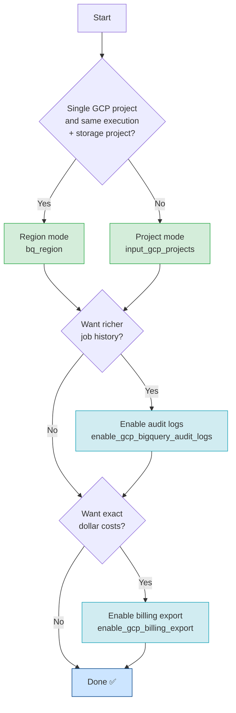

# Configuration

Settings have default values that can be overridden using:

- **dbt project variables** (defined in `dbt_project.yml` or passed via CLI `--vars`)
- **Environment variables** (prefixed with `DBT_BQ_MONITORING_`)

Environment variables always take priority over dbt variables, which take priority over defaults.

:::tip

To get the best out of this package, configure all relevant data sources:

1. Pick the right **[mode](#modes)** for your GCP setup (region vs. project)
2. **[Add metadata to queries](#add-metadata-to-queries-recommended)** so dbt model names show up in job costs
3. Enable **[GCP BigQuery audit logs](/configuration/audit-logs)** for richer job history
4. Enable **[GCP Billing export](/configuration/gcp-billing)** for exact dollar costs
5. Tune **[package settings](/configuration/package-settings)** (pricing, look-back window, etc.)

:::

## How to choose your setup



---

## Modes

The package has two base modes that control how it reads from `INFORMATION_SCHEMA`.

:::note

The default region is `us`. There is no cross-region querying in BigQuery, so use
one dbt project per region and optionally
[replicate tables to a central region](https://cloud.google.com/bigquery/docs/data-replication)
for an aggregated view.

To find a job's region: open **Job history** in the BQ UI → click a job → look at the **Location** field.

:::

### Region mode (default)

Monitor all BigQuery jobs in a single GCP region. This is the simplest setup.
All `INFORMATION_SCHEMA` models are **ephemeral**, so they can be referenced directly in your own models.

**When to use:** single project, or multiple projects all in the same region where your execution project equals the storage project.

```yml
# dbt_project.yml
vars:
  bq_region: 'us'          # US multi-region (default)
  # bq_region: 'EU'        # EU multi-region
  # bq_region: 'europe-west1'  # specific region
```

:::warning

If you have **multiple GCP projects in the same region** but your execution project differs from the storage project, you will hit this error:

```
Within a standard SQL view, references to tables/views require explicit project IDs
unless the entity is created in the same project that is issuing the query
```

Switch to **project mode** in this case.

:::

### Project mode

Monitor specific GCP projects by listing them explicitly. All `INFORMATION_SCHEMA` tables are
materialized into consolidated BigQuery tables via the `project_by_project_table` custom materialization.

**When to use:** multiple GCP projects, or when your dbt execution project is different from the monitored projects.

```yml
# dbt_project.yml
vars:
  input_gcp_projects:
    - 'my-production-project'
    - 'my-analytics-project'
    - 'my-platform-project'
```

#### Supported input formats for `input_gcp_projects`

You can pass projects in multiple ways — all are normalized internally to a list of strings.

**In `dbt_project.yml`:**

```yml
vars:
  input_gcp_projects: 'single-project'                      # single project as string
  input_gcp_projects: ['project-a', 'project-b']            # multiple projects as list
```

**From the CLI:**

```bash
# Single project
dbt run --vars '{"input_gcp_projects": "my-project"}'

# Multiple projects
dbt run --vars '{"input_gcp_projects": ["project-a", "project-b"]}'
```

**As environment variables:**

```bash
# Single project
export DBT_BQ_MONITORING_GCP_PROJECTS="my-project"

# Multiple projects (with or without quotes around values)
export DBT_BQ_MONITORING_GCP_PROJECTS='["project-a","project-b"]'
export DBT_BQ_MONITORING_GCP_PROJECTS='[project-a,project-b]'

# Empty (region mode will be used as fallback)
export DBT_BQ_MONITORING_GCP_PROJECTS='[]'
```

:::warning

In project mode, the package creates **intermediate materialized tables** per project to avoid
BigQuery limits when querying too many projects simultaneously. This is handled automatically
via the `project_by_project_table` custom materialization in the `macros` folder.

These extra tables need to be refreshed regularly — include them in your scheduled runs.

:::

---

## Add metadata to queries (Recommended)

Tag every BigQuery job with dbt model metadata (model name, package, node ID). This enables
the `most_expensive_models` datamart and lets you trace costs back to specific dbt models.

Add the following to `dbt_project.yml`:

```yaml
query-comment:
  comment: '{{ dbt_bigquery_monitoring.get_query_comment(node) }}'
  job-label: true   # Promotes the JSON comment to BigQuery job labels
```

Once set, every query run by dbt will carry a structured comment like:

```json
{
  "dbt_version": "1.9.0",
  "app": "dbt",
  "profile_name": "my_profile",
  "target_name": "prod",
  "node_id": "model.my_project.my_model"
}
```

See the [dbt query-comment documentation](https://docs.getdbt.com/reference/project-configs/query-comment) for more options.

---

## Configuration matrix

Use this table to determine which variables are required vs. optional for each scenario.

| Scenario | Required variables | Optional variables | Guide |
|---|---|---|---|
| **Region mode** (default) | `bq_region` | `output_partition_expiration_days`, `use_flat_pricing`, `per_billed_tb_price` | [Package settings](/configuration/package-settings) |
| **Project mode** | `input_gcp_projects` | `bq_region`, `output_partition_expiration_days`, `use_flat_pricing` | [Package settings](/configuration/package-settings) |
| **Audit logs** | `enable_gcp_bigquery_audit_logs`, `gcp_bigquery_audit_logs_storage_project`, `gcp_bigquery_audit_logs_dataset`, `gcp_bigquery_audit_logs_table` | `should_combine_audit_logs_and_information_schema`, `google_information_schema_model_materialization` | [Audit logs](/configuration/audit-logs) |
| **Billing export** | `enable_gcp_billing_export`, `gcp_billing_export_storage_project`, `gcp_billing_export_dataset`, `gcp_billing_export_table` | `lookback_incremental_billing_window_days` | [GCP billing export](/configuration/gcp-billing) |
| **Query metadata** | `query-comment.comment` + `query-comment.job-label` in `dbt_project.yml` | — | [Query comments](https://docs.getdbt.com/reference/project-configs/query-comment) |

---

## Troubleshooting

### Debug all resolved variable values

Run this command to log every variable with its resolved value and source (env var, dbt var, or default):

```bash
dbt run-operation debug_dbt_bigquery_monitoring_variables
```

### Variable priority order

Variables are resolved in this order (first match wins):

1. **Environment variables** (`DBT_BQ_MONITORING_*`)
2. **dbt CLI variables** (`dbt run --vars '{...}'`)
3. **`dbt_project.yml` variables** (`vars:` section)
4. **Package defaults**

### Common errors

| Error | Likely cause | Fix |
|---|---|---|
| `references to tables/views require explicit project IDs` | Region mode with mismatched execution/storage project | Switch to project mode with `input_gcp_projects` |
| Model produces no rows | `bq_region` doesn't match your data location | Check region with Job History → Location |
| `placeholder` in variable value | Required variable not set | Set the variable in `dbt_project.yml` or via env var |
