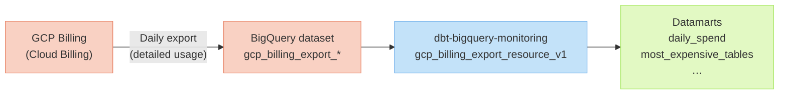

# GCP Billing export

The GCP Billing export integration lets the package track **real dollar costs** for your BigQuery
queries and storage over time, instead of estimating them from bytes processed.

Without billing export, the package computes costs from pricing formulas (configurable in
[package settings](/configuration/package-settings)). With billing export, you get exact
invoice-level costs directly from GCP.

## What it enables



---

## Step 1 — Enable Cloud Billing export in GCP

Follow the [official GCP documentation](https://cloud.google.com/billing/docs/how-to/export-data-bigquery)
to set up the **detailed usage cost export** to BigQuery. The key steps are:

1. Open **Billing → Billing export** in the GCP Console.
2. Select **BigQuery export → Detailed usage cost**.
3. Choose a project and dataset where the export will be written.
4. Enable the export — GCP will create a table named `gcp_billing_export_resource_v1_*` in your dataset.

:::tip

Use the **Detailed usage cost** export (not the Standard one) — it provides SKU-level
granularity which gives the package much more accurate per-job cost attribution.

:::

---

## Step 2 — Configure the package

Add the following variables to your `dbt_project.yml`:

```yml
# dbt_project.yml
vars:
  enable_gcp_billing_export: true
  gcp_billing_export_storage_project: 'my-billing-project'   # project that holds the export dataset
  gcp_billing_export_dataset: 'my_billing_dataset'           # dataset where GCP writes the export
  gcp_billing_export_table: 'gcp_billing_export_resource_v1' # table name (without date suffix)
```

Or set them as environment variables:

```bash
export DBT_BQ_MONITORING_ENABLE_GCP_BILLING_EXPORT="true"
export DBT_BQ_MONITORING_GCP_BILLING_EXPORT_STORAGE_PROJECT="my-billing-project"
export DBT_BQ_MONITORING_GCP_BILLING_EXPORT_DATASET="my_billing_dataset"
export DBT_BQ_MONITORING_GCP_BILLING_EXPORT_TABLE="gcp_billing_export_resource_v1"
```

---

## Variables reference

| Variable | Environment Variable | Description | Default |
|---|---|---|---|
| `enable_gcp_billing_export` | `DBT_BQ_MONITORING_ENABLE_GCP_BILLING_EXPORT` | Toggle billing export integration | `false` |
| `gcp_billing_export_storage_project` | `DBT_BQ_MONITORING_GCP_BILLING_EXPORT_STORAGE_PROJECT` | GCP project containing the billing export dataset | required if enabled |
| `gcp_billing_export_dataset` | `DBT_BQ_MONITORING_GCP_BILLING_EXPORT_DATASET` | Dataset where GCP writes billing data | required if enabled |
| `gcp_billing_export_table` | `DBT_BQ_MONITORING_GCP_BILLING_EXPORT_TABLE` | Table name for billing export (without date suffix) | required if enabled |
| `lookback_incremental_billing_window_days` | `DBT_BQ_MONITORING_LOOKBACK_INCREMENTAL_BILLING_WINDOW_DAYS` | Days to re-read for late-arriving billing records | `3` |

:::note

Billing data can arrive late (up to 48 hours). The `lookback_incremental_billing_window_days`
variable (default: `3`) controls how far back to re-read billing data on each incremental run
to catch late-arriving records.

:::

---

## Verifying the setup

After running the package, check that costs are populated:

```bash
dbt run -s gcp_billing_export_resource_v1
dbt run-operation debug_dbt_bigquery_monitoring_variables
```

Then query the datamart:

```sql
SELECT
  day,
  cost_category,
  ROUND(SUM(cost), 2) AS total_cost
FROM {{ ref('daily_spend') }}
WHERE day >= DATE_SUB(CURRENT_DATE(), INTERVAL 7 DAY)
GROUP BY 1, 2
ORDER BY 1 DESC
```
