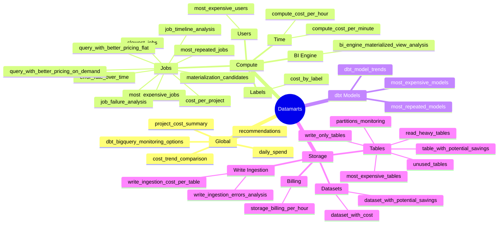

# Monitoring Datamarts

The package provides **34 ready-to-use datamarts** organized into four groups: Global, Compute, dbt models, and Storage.
Each datamart is designed for direct BI tool consumption (Looker, Tableau, Superset) or ad-hoc SQL analysis.



---

## 🌍 Global

High-level spending overview across all GCP projects, combining compute and storage.

### `daily_spend`

Your top-level daily cost summary. Aggregates compute and storage spending by day.
Uses **actual billing data** when GCP billing export is enabled, otherwise falls back to pricing formula estimates.

```sql
-- Total spend per category over the last 30 days
SELECT
  DATE(day) AS date,
  cost_category,
  ROUND(SUM(cost), 2) AS total_cost_usd
FROM {{ ref('daily_spend') }}
WHERE day >= TIMESTAMP_SUB(CURRENT_TIMESTAMP(), INTERVAL 30 DAY)
GROUP BY 1, 2
ORDER BY 1 DESC, 2
```

---

### `cost_trend_comparison`

Daily cost enriched with rolling averages and week-over-week change — ideal for anomaly detection dashboards and cost spike alerts.

**Key columns:** `daily_cost`, `rolling_7d_avg_cost`, `rolling_30d_avg_cost`, `wow_pct_change`, `pct_deviation_from_7d_avg`

```sql
-- Find days where spend was more than 30% above the 7-day average
SELECT
  DATE(day) AS date,
  cost_category,
  daily_cost,
  rolling_7d_avg_cost,
  ROUND(pct_deviation_from_7d_avg, 1) AS deviation_pct
FROM {{ ref('cost_trend_comparison') }}
WHERE pct_deviation_from_7d_avg > 30
ORDER BY day DESC
```

---

### `project_cost_summary`

Combined compute + storage cost summary per GCP project — great for executive dashboards and cross-project chargeback.

**Key columns:** `project_id`, `compute_cost`, `storage_monthly_forecast`, `total_estimated_cost`, `storage_potential_savings`, `query_count`, `unique_users`, `table_count`

```sql
-- Top 10 projects by total estimated cost
SELECT
  project_id,
  ROUND(compute_cost, 2)           AS compute_cost_usd,
  ROUND(storage_monthly_forecast, 2) AS storage_forecast_usd,
  ROUND(total_estimated_cost, 2)   AS total_cost_usd,
  query_count,
  unique_users
FROM {{ ref('project_cost_summary') }}
ORDER BY total_cost_usd DESC
LIMIT 10
```

---

### `recommendations`

Surfaces **active BigQuery recommendations from Google** — partitioning, clustering, materialized views, idle table removal — with cost impact estimates.

**Key columns:** `project_id`, `recommender_label`, `description`, `priority`, `estimated_monthly_savings`, `target_resources`

```sql
-- All high-priority recommendations with estimated savings > $10/month
SELECT
  project_id,
  recommender_label,
  description,
  priority,
  ROUND(estimated_monthly_savings, 2) AS savings_usd_per_month,
  target_resources
FROM {{ ref('recommendations') }}
WHERE priority IN ('P1', 'P2')
  AND estimated_monthly_savings > 10
ORDER BY estimated_monthly_savings DESC
```

---

### `dbt_bigquery_monitoring_options`

A diagnostic snapshot of the package's current configuration — every resolved variable and its value. Useful for auditing your setup.

```sql
-- Check current configuration
SELECT option_label, option_value
FROM {{ ref('dbt_bigquery_monitoring_options') }}
ORDER BY option_label
```

---

## ⚡ Compute — Jobs

Analyze individual query jobs: cost, performance, failures, and pricing optimization opportunities.

### `most_expensive_jobs`

Lists the most expensive individual queries ranked by cost. The go-to view for identifying cost outliers and rogue queries.

**Key columns:** `job_id`, `user_email`, `project_id`, `query`, `query_cost`, `total_slot_ms`, `total_bytes_billed`, `creation_time`

```sql
-- Queries costing more than $1 in the last 7 days
SELECT
  user_email,
  project_id,
  ROUND(query_cost, 4)  AS cost_usd,
  total_slot_ms / 1000  AS slot_seconds,
  LEFT(query, 120)      AS query_preview,
  DATE(hour)            AS date
FROM {{ ref('most_expensive_jobs') }}
WHERE query_cost > 1
ORDER BY cost_usd DESC
LIMIT 50
```

---

### `slowest_jobs`

Lists the queries with the longest total execution time. Useful for latency analysis and SLA monitoring.

**Key columns:** same as `most_expensive_jobs` plus `total_time_seconds`, `rank_duration`

```sql
-- Top 20 slowest queries in the past week
SELECT
  user_email,
  ROUND(total_time_seconds / 60, 1) AS duration_minutes,
  ROUND(query_cost, 4)               AS cost_usd,
  LEFT(query, 120)                   AS query_preview
FROM {{ ref('slowest_jobs') }}
ORDER BY total_time_seconds DESC
LIMIT 20
```

---

### `most_repeated_jobs`

Identifies queries that run repeatedly with the same SQL text. High repetition with low cache hit rates signals caching or materialization opportunities.

**Key columns:** `query`, `query_count`, `total_query_cost`, `cache_hit_ratio`, `total_slot_ms`, `user_emails`

```sql
-- Frequently repeated queries with poor cache hit rates
SELECT
  LEFT(query, 100) AS query_preview,
  query_count,
  ROUND(total_query_cost, 2) AS total_cost_usd,
  ROUND(cache_hit_ratio * 100, 1) AS cache_hit_pct
FROM {{ ref('most_repeated_jobs') }}
WHERE query_count >= 10
  AND cache_hit_ratio < 0.1
ORDER BY total_query_cost DESC
LIMIT 20
```

---

### `job_failure_analysis`

Groups failed jobs by error type and message, showing which errors are most common, how much compute was wasted, and which users/projects are affected.

**Key columns:** `error_reason`, `error_message`, `error_count`, `total_failed_cost`, `top_affected_projects`, `top_affected_users`, `first_occurrence`, `last_occurrence`

```sql
-- Most costly error types
SELECT
  error_reason,
  LEFT(error_message, 100) AS error_preview,
  error_count,
  ROUND(total_failed_cost, 2) AS wasted_usd,
  top_affected_projects,
  first_occurrence,
  last_occurrence
FROM {{ ref('job_failure_analysis') }}
ORDER BY wasted_usd DESC
LIMIT 20
```

---

### `error_rate_over_time`

Time-series error rate by project and user, with a 7-day rolling average. Use this to set reliability alert thresholds or spot degradation trends.

**Key columns:** `day`, `project_id`, `user_email`, `total_jobs`, `failed_jobs`, `error_rate_pct`, `wasted_cost_on_failures`, `rolling_7d_avg_error_rate_pct`

```sql
-- Projects with a daily error rate > 5% in the past 30 days
SELECT
  DATE(day)   AS date,
  project_id,
  total_jobs,
  failed_jobs,
  error_rate_pct,
  ROUND(wasted_cost_on_failures, 2) AS wasted_usd
FROM {{ ref('error_rate_over_time') }}
WHERE error_rate_pct > 5
  AND day >= TIMESTAMP_SUB(CURRENT_TIMESTAMP(), INTERVAL 30 DAY)
ORDER BY day DESC, wasted_usd DESC
```

---

### `job_timeline_analysis`

Deep slot utilization analysis using `INFORMATION_SCHEMA.JOBS_TIMELINE`. Classifies jobs by queue time, slot efficiency, and duration, and generates an optimization recommendation per job group.

**Key columns:** `project_id`, `user_email`, `job_type`, `queue_performance`, `slot_efficiency`, `duration_category`, `avg_slot_utilization_pct`, `cache_hit_rate_pct`, `optimization_recommendation`

```sql
-- Groups of jobs with poor slot utilization and long runtimes
SELECT
  project_id,
  user_email,
  job_type,
  duration_category,
  slot_efficiency,
  ROUND(avg_duration_seconds / 60, 1) AS avg_duration_min,
  ROUND(avg_slot_utilization_pct, 1)  AS slot_util_pct,
  optimization_recommendation
FROM {{ ref('job_timeline_analysis') }}
WHERE slot_efficiency = 'Low Utilization'
  AND duration_category = 'Long Running'
ORDER BY total_slot_seconds DESC
```

---

### `materialization_candidates`

Identifies queries that are **strong candidates for materialized views or scheduled queries**: high frequency, significant cost, and low cache hit rate. Shows potential savings if the queries were cached.

**Key columns:** `query`, `query_count`, `total_query_cost`, `cache_hit_ratio`, `potential_savings_from_caching`, `materialization_recommendation`, `first_seen`, `last_seen`

```sql
-- High-value candidates for materialization
SELECT
  LEFT(query, 100)                       AS query_preview,
  query_count,
  ROUND(total_query_cost, 2)             AS total_cost_usd,
  ROUND(cache_hit_ratio * 100, 1)        AS cache_hit_pct,
  ROUND(potential_savings_from_caching, 2) AS potential_savings_usd,
  materialization_recommendation
FROM {{ ref('materialization_candidates') }}
WHERE materialization_recommendation LIKE 'High%'
ORDER BY potential_savings_usd DESC
LIMIT 20
```

---

### `cost_per_project`

Daily compute cost breakdown per GCP project. Enables cross-project cost comparison and trend tracking.

**Key columns:** `day`, `project_id`, `total_query_cost`, `total_failing_query_cost`, `query_count`, `unique_users`, `cache_hit_ratio`, `avg_duration_seconds`

```sql
-- Compare compute spend across projects over the last 7 days
SELECT
  DATE(day)   AS date,
  project_id,
  ROUND(total_query_cost, 2)  AS cost_usd,
  query_count,
  unique_users,
  ROUND(cache_hit_ratio * 100, 1) AS cache_hit_pct
FROM {{ ref('cost_per_project') }}
WHERE day >= TIMESTAMP_SUB(CURRENT_TIMESTAMP(), INTERVAL 7 DAY)
ORDER BY day DESC, cost_usd DESC
```

---

### `query_with_better_pricing_using_flat_pricing_view`

Lists queries where **switching to flat-rate (slot) pricing would be cheaper** than on-demand. Shows the potential savings per query.

**Key columns:** `job_id`, `query`, `ondemand_query_cost`, `flat_pricing_query_cost`, `cost_savings`, `cost_savings_pct`

```sql
-- Queries that could save the most by switching to flat-rate pricing
SELECT
  user_email,
  LEFT(query, 100)            AS query_preview,
  ROUND(ondemand_query_cost, 4)      AS on_demand_usd,
  ROUND(flat_pricing_query_cost, 4)  AS flat_rate_usd,
  ROUND(cost_savings, 4)             AS savings_usd
FROM {{ ref('query_with_better_pricing_using_flat_pricing_view') }}
ORDER BY cost_savings DESC
LIMIT 20
```

---

### `query_with_better_pricing_using_on_demand_view`

Lists queries where **switching to on-demand pricing would be cheaper** than flat-rate. Helps right-size slot commitments.

```sql
-- Queries cheaper on on-demand — useful if evaluating downsizing slot reservations
SELECT
  user_email,
  LEFT(query, 100)           AS query_preview,
  ROUND(flat_pricing_query_cost, 4) AS flat_rate_usd,
  ROUND(ondemand_query_cost, 4)     AS on_demand_usd,
  ROUND(cost_savings, 4)            AS savings_usd
FROM {{ ref('query_with_better_pricing_using_on_demand_view') }}
ORDER BY cost_savings DESC
LIMIT 20
```

---

## ⚡ Compute — Users

### `most_expensive_users`

Aggregates compute spending by user/service account per day — the foundation for cost chargeback and identifying teams that need optimization training.

**Key columns:** `day`, `user_email`, `total_query_cost`, `avg_query_cost`, `query_count`, `cache_hit_ratio`, `avg_slot_seconds_per_query`

```sql
-- Top 10 spenders this month
SELECT
  user_email,
  ROUND(SUM(total_query_cost), 2) AS total_spend_usd,
  SUM(query_count)                 AS total_queries,
  ROUND(AVG(cache_hit_ratio) * 100, 1) AS cache_hit_pct
FROM {{ ref('most_expensive_users') }}
WHERE day >= TIMESTAMP_TRUNC(CURRENT_TIMESTAMP(), MONTH)
GROUP BY user_email
ORDER BY total_spend_usd DESC
LIMIT 10
```

---

## ⚡ Compute — Time

### `compute_cost_per_hour_view`

Hourly compute cost with year/month/day time truncations added for easy BI tool grouping. Wraps the `compute_cost_per_hour` intermediate table.

```sql
-- Rolling hourly cost for the past 24 hours
SELECT
  hour,
  project_id,
  ROUND(total_query_cost, 4) AS cost_usd,
  query_count,
  ROUND(cache_hit_ratio * 100, 1) AS cache_hit_pct
FROM {{ ref('compute_cost_per_hour_view') }}
WHERE hour >= TIMESTAMP_SUB(CURRENT_TIMESTAMP(), INTERVAL 24 HOUR)
ORDER BY hour DESC
```

---

### `compute_cost_per_minute_view`

Same as `compute_cost_per_hour_view` but at one-minute granularity — useful for spotting cost spikes within hours.

```sql
-- Minutes with the highest cost in the last 6 hours
SELECT
  CAST(minute AS DATETIME) AS minute,
  project_id,
  ROUND(total_query_cost, 4) AS cost_usd,
  query_count
FROM {{ ref('compute_cost_per_minute_view') }}
WHERE minute >= TIMESTAMP_SUB(CURRENT_TIMESTAMP(), INTERVAL 6 HOUR)
ORDER BY cost_usd DESC
LIMIT 50
```

---

## ⚡ Compute — Labels

### `cost_by_label`

Breaks down compute cost by BigQuery **job label key + value**. The foundation for FinOps cost allocation and chargeback when you label your queries by team, environment, or product.

:::tip

Label your BigQuery jobs using the [query comment feature](/configuration#add-metadata-to-queries-recommended) or by explicitly setting labels in your SQL using `SET @@query_label`. Labels must be set before the job runs.

:::

**Key columns:** `day`, `label_key`, `label_value`, `project_id`, `total_query_cost`, `query_count`, `cache_hit_ratio`, `failed_queries`

```sql
-- Cost breakdown by team label for this month
SELECT
  label_value              AS team,
  ROUND(SUM(total_query_cost), 2) AS total_cost_usd,
  SUM(query_count)          AS total_queries,
  SUM(failed_queries)       AS failures
FROM {{ ref('cost_by_label') }}
WHERE label_key = 'team'
  AND day >= TIMESTAMP_TRUNC(CURRENT_TIMESTAMP(), MONTH)
GROUP BY team
ORDER BY total_cost_usd DESC
```

---

## ⚡ Compute — BI Engine

### `bi_engine_materialized_view_analysis`

Analyzes BI Engine usage effectiveness by project. Shows which BI Engine mode is active, average performance, cache hit rates, and optimization recommendations.

**Key columns:** `project_id`, `bi_engine_mode`, `bi_engine_queries`, `bi_engine_avg_slot_seconds`, `bi_engine_cache_hit_percentage`, `bi_engine_performance_tier`, `optimization_recommendation`

```sql
-- BI Engine performance by project
SELECT
  project_id,
  bi_engine_mode,
  bi_engine_queries,
  ROUND(bi_engine_cache_hit_percentage, 1) AS cache_hit_pct,
  bi_engine_performance_tier,
  optimization_recommendation
FROM {{ ref('bi_engine_materialized_view_analysis') }}
ORDER BY bi_engine_queries DESC
```

---

## 🔧 Compute — dbt Models

> **Prerequisite:** requires [query comments](/configuration#add-metadata-to-queries-recommended) to be configured. Without them, `dbt_model_name` will be NULL and these datamarts will be empty.

### `most_expensive_models`

Ranks every dbt model by its total compute cost, aggregated across all runs. The key tool for model-level cost optimization in dbt projects.

**Key columns:** `dbt_model_name`, `total_query_cost`, `query_count`, `cache_hit_ratio`, `total_slot_ms`, `project_ids`, `user_emails`

```sql
-- Top 15 most expensive dbt models overall
SELECT
  dbt_model_name,
  ROUND(total_query_cost, 2)   AS total_cost_usd,
  query_count                   AS run_count,
  ROUND(total_query_cost / NULLIF(query_count, 0), 4) AS avg_cost_per_run,
  ROUND(cache_hit_ratio * 100, 1) AS cache_hit_pct
FROM {{ ref('most_expensive_models') }}
ORDER BY total_cost_usd DESC
LIMIT 15
```

---

### `most_repeated_models`

Ranks dbt models by how many times they've been run (only models with >1 execution). Useful for identifying models that run too frequently or have scheduling duplication.

```sql
-- Models running more than 100 times unexpectedly
SELECT
  dbt_model_name,
  query_count       AS run_count,
  ROUND(total_query_cost, 2) AS total_cost_usd,
  ROUND(cache_hit_ratio * 100, 1) AS cache_hit_pct
FROM {{ ref('most_repeated_models') }}
WHERE query_count > 100
ORDER BY run_count DESC
```

---

### `dbt_model_trends`

Daily time-series of cost, run count, duration (avg/p90/max), failure rate, and cache hit ratio per dbt model. Detect cost regressions and performance degradation over time.

**Key columns:** `day`, `dbt_model_name`, `query_count`, `total_query_cost`, `avg_query_cost`, `avg_duration_seconds`, `p90_duration_seconds`, `failed_runs`, `failure_rate`, `cache_hit_ratio`

```sql
-- Compare cost of a specific model week-over-week
SELECT
  DATE(day) AS date,
  ROUND(total_query_cost, 4) AS cost_usd,
  query_count,
  ROUND(avg_duration_seconds, 1) AS avg_duration_s,
  ROUND(p90_duration_seconds, 1) AS p90_duration_s,
  failed_runs,
  ROUND(failure_rate * 100, 2) AS failure_rate_pct
FROM {{ ref('dbt_model_trends') }}
WHERE dbt_model_name = 'my_expensive_model'
ORDER BY day DESC
LIMIT 30
```

---

## 💾 Storage — Tables

### `most_expensive_tables`

Lists all tables ordered by their estimated monthly storage cost. The starting point for any storage optimization effort.

**Key columns:** `project_id`, `dataset_id`, `table_id`, `table_type`, `storage_billing_model`, `total_logical_bytes`, `total_physical_bytes`, `cost_monthly_forecast`, `potential_savings`

```sql
-- Top 10 tables by monthly storage cost
SELECT
  CONCAT(project_id, '.', dataset_id, '.', table_id) AS full_table_path,
  storage_billing_model,
  ROUND(total_logical_bytes / POW(1024, 3), 1)  AS size_gb,
  ROUND(cost_monthly_forecast, 2)                AS monthly_cost_usd,
  ROUND(potential_savings, 2)                    AS potential_savings_usd
FROM {{ ref('most_expensive_tables') }}
LIMIT 10
```

---

### `unused_tables`

All tables with their last-used date (from query history). Null `last_used_date` means the table has never been queried. Prime candidates for archival or deletion.

**Key columns:** `project_id`, `dataset_id`, `table_id`, `last_used_date`, `cost_monthly_forecast`, `total_rows`, `total_logical_bytes`, `storage_last_modified_time`

```sql
-- Tables costing > $5/month that haven't been queried in 90+ days
SELECT
  CONCAT(project_id, '.', dataset_id, '.', table_id) AS full_table_path,
  DATE(last_used_date)       AS last_queried,
  DATE(storage_last_modified_time) AS last_modified,
  ROUND(cost_monthly_forecast, 2)  AS monthly_cost_usd,
  total_rows
FROM {{ ref('unused_tables') }}
WHERE (last_used_date IS NULL
       OR last_used_date < TIMESTAMP_SUB(CURRENT_TIMESTAMP(), INTERVAL 90 DAY))
  AND cost_monthly_forecast > 5
ORDER BY monthly_cost_usd DESC
```

---

### `write_only_tables`

Detects tables that are **actively written to but never read** within the lookback window. These pipeline outputs are likely no longer consumed — candidates for archival or deletion.

**Key columns:** `project_id`, `dataset_id`, `table_id`, `storage_last_modified_time`, `last_read_date`, `last_read_label`, `days_since_last_write`, `cost_monthly_forecast`

```sql
-- Expensive tables that are being written but never read
SELECT
  CONCAT(project_id, '.', dataset_id, '.', table_id) AS full_table_path,
  last_read_label,
  days_since_last_write,
  ROUND(cost_monthly_forecast, 2) AS monthly_cost_usd
FROM {{ ref('write_only_tables') }}
WHERE cost_monthly_forecast > 1
ORDER BY monthly_cost_usd DESC
LIMIT 20
```

---

### `read_heavy_tables`

Tables with high read frequency (many query references) combined with their storage cost. Helps identify tables that are hotspots and might benefit from BI Engine or result caching.

**Key columns:** `project_id`, `dataset_id`, `table_id`, `reference_count`, `cost_monthly_forecast`, `total_logical_bytes`

```sql
-- Tables read the most — candidates for BI Engine acceleration
SELECT
  CONCAT(project_id, '.', dataset_id, '.', table_id) AS full_table_path,
  reference_count,
  ROUND(cost_monthly_forecast, 2) AS monthly_cost_usd,
  ROUND(total_logical_bytes / POW(1024, 3), 1) AS size_gb
FROM {{ ref('read_heavy_tables') }}
ORDER BY reference_count DESC
LIMIT 20
```

---

### `partitions_monitoring`

Lists all partitioned tables with their partition type, count, and earliest/latest partition timestamps. Useful for auditing partition health and identifying tables with partition expiration issues.

**Key columns:** `project_id`, `dataset_id`, `table_id`, `partition_type`, `partition_count`, `earliest_partition_id`, `latest_partition_id`, `earliest_partition_time`, `latest_partition_time`

```sql
-- Partitioned tables with very old earliest partitions (potential long-tail storage)
SELECT
  CONCAT(project_id, '.', dataset_id, '.', table_id) AS full_table_path,
  partition_type,
  partition_count,
  DATE(earliest_partition_time) AS oldest_partition_date,
  DATE(latest_partition_time)   AS newest_partition_date
FROM {{ ref('partitions_monitoring') }}
WHERE earliest_partition_time < TIMESTAMP('2022-01-01')
ORDER BY partition_count DESC
```

---

### `table_with_potential_savings`

Lists base tables where switching storage billing model (logical → physical or vice versa) would save money.

**Key columns:** `project_id`, `dataset_id`, `table_id`, `storage_billing_model`, `optimal_storage_billing_model`, `logical_cost_monthly_forecast`, `physical_cost_monthly_forecast`, `potential_savings`

```sql
-- Tables where switching to physical billing saves the most
SELECT
  CONCAT(project_id, '.', dataset_id, '.', table_id) AS full_table_path,
  storage_billing_model         AS current_model,
  optimal_storage_billing_model AS better_model,
  ROUND(potential_savings, 2)   AS savings_usd_per_month
FROM {{ ref('table_with_potential_savings') }}
WHERE potential_savings > 5
ORDER BY potential_savings DESC
LIMIT 20
```

---

## 💾 Storage — Datasets

### `dataset_with_cost`

Storage cost breakdown aggregated at dataset level, with both logical and physical billing model costs so you can compare them. Includes time travel and fail-safe byte breakdowns.

**Key columns:** `project_id`, `dataset_id`, `total_logical_bytes`, `total_physical_bytes`, `logical_cost_monthly_forecast`, `physical_cost_monthly_forecast`, `prefer_physical_pricing_model`, `storage_pricing_model_difference`

```sql
-- Datasets where physical pricing would be cheaper
SELECT
  CONCAT(project_id, '.', dataset_id) AS dataset_path,
  ROUND(logical_cost_monthly_forecast, 2)  AS logical_cost_usd,
  ROUND(physical_cost_monthly_forecast, 2) AS physical_cost_usd,
  ROUND(storage_pricing_model_difference, 2) AS savings_by_switching_usd
FROM {{ ref('dataset_with_cost') }}
WHERE prefer_physical_pricing_model = TRUE
ORDER BY savings_by_switching_usd DESC
LIMIT 20
```

---

### `dataset_with_potential_savings`

Aggregates potential savings by switching billing model, grouped at the dataset level. Surfaces the datasets where changing the billing model would have the biggest impact.

**Key columns:** `project_id`, `dataset_id`, `storage_billing_model`, `optimal_storage_billing_model`, `maximum_potential_savings`, `logical_cost_monthly_forecast`, `physical_cost_monthly_forecast`

```sql
-- Datasets with the most savings potential from billing model switch
SELECT
  CONCAT(project_id, '.', dataset_id) AS dataset_path,
  storage_billing_model         AS current_model,
  optimal_storage_billing_model AS better_model,
  ROUND(maximum_potential_savings, 2) AS max_savings_usd
FROM {{ ref('dataset_with_potential_savings') }}
ORDER BY max_savings_usd DESC
LIMIT 20
```

---

## 💾 Storage — Write Ingestion

### `write_ingestion_cost_per_table`

Combines **Streaming API** and **Storage Write API** ingestion volume and estimated cost per table per day. Helps you understand which tables are the most expensive to write to.

**Key columns:** `day`, `project_id`, `dataset_id`, `table_id`, `source_type` (`streaming` / `write_api`), `total_rows`, `total_input_mb`, `error_count`, `error_rate`, `estimated_cost`

```sql
-- Most expensive write ingestion destinations this week
SELECT
  DATE(day)  AS date,
  CONCAT(project_id, '.', dataset_id, '.', table_id) AS full_table_path,
  source_type,
  SUM(total_rows)           AS total_rows_written,
  ROUND(SUM(total_input_mb), 2) AS total_mb,
  ROUND(SUM(estimated_cost), 4) AS estimated_cost_usd
FROM {{ ref('write_ingestion_cost_per_table') }}
WHERE day >= TIMESTAMP_SUB(CURRENT_TIMESTAMP(), INTERVAL 7 DAY)
GROUP BY 1, 2, 3
ORDER BY estimated_cost_usd DESC
LIMIT 20
```

---

### `write_ingestion_errors_analysis`

Error pattern analysis for write ingestion (Streaming API + Storage Write API). Groups errors by project, table, and error code with an overall error rate. Essential for debugging ingestion reliability issues.

**Key columns:** `project_id`, `dataset_id`, `table_id`, `source_type`, `error_code`, `error_request_count`, `error_row_count`, `error_rate`, `first_occurrence`, `last_occurrence`

```sql
-- Tables with the highest write error rates
SELECT
  CONCAT(project_id, '.', dataset_id, '.', table_id) AS full_table_path,
  source_type,
  error_code,
  error_request_count,
  ROUND(error_rate * 100, 2)   AS error_rate_pct,
  DATE(first_occurrence)       AS first_seen,
  DATE(last_occurrence)        AS last_seen
FROM {{ ref('write_ingestion_errors_analysis') }}
WHERE error_rate > 0.01   -- more than 1% error rate
ORDER BY error_request_count DESC
LIMIT 20
```

---

## 💾 Storage — Billing

### `storage_billing_per_hour`

Hourly storage cost from the GCP billing export, broken down by storage SKU type. Only available when `enable_gcp_billing_export: true`.

**Key columns:** `hour`, `storage_type`, `storage_cost`, `currency_symbol`

```sql
-- Daily storage cost trend by SKU type
SELECT
  DATE(hour)     AS date,
  storage_type,
  ROUND(SUM(storage_cost), 4) AS daily_cost
FROM {{ ref('storage_billing_per_hour') }}
WHERE hour >= TIMESTAMP_SUB(CURRENT_TIMESTAMP(), INTERVAL 30 DAY)
GROUP BY 1, 2
ORDER BY 1 DESC, daily_cost DESC
```
