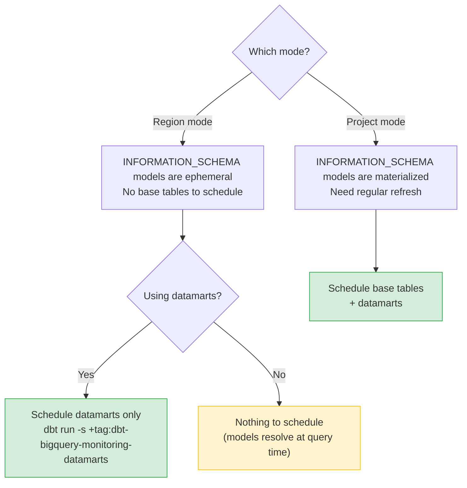

# Running the package

Make sure you've completed [configuration](/configuration) before scheduling jobs.

## Region mode vs project mode

The scheduling requirements differ between modes:



**Region mode:** INFORMATION_SCHEMA models are ephemeral. You only need to schedule runs if you use datamarts.

**Project mode:** All INFORMATION_SCHEMA tables are materialized into consolidated tables and wrapper
models become views. Schedule both the base tables and datamarts regularly.

---

## Scheduling cadence

The package uses incremental models — it only re-reads data it hasn't processed yet, keeping
runs fast even with large datasets.

Data is partitioned at **hourly granularity**, so the most cost-efficient cadence is **hourly**.
Run more frequently if you need near-real-time data.

---

## Scheduling commands

Pick the command that matches your use case:

### Datamarts only (recommended for most users)

```bash
# Run all datamarts and their upstream dependencies
dbt run -s +tag:dbt-bigquery-monitoring-datamarts
```

### INFORMATION_SCHEMA tables only (project mode)

```bash
# Refresh the consolidated INFORMATION_SCHEMA tables
dbt run -s +tag:dbt-bigquery-monitoring-information-schema
```

### Compute datamarts only

```bash
# Run compute-related datamarts and their upstream dependencies
dbt run -s +tag:dbt-bigquery-monitoring-compute
```

### Storage datamarts only

```bash
# Run storage-related datamarts and their upstream dependencies
dbt run -s +tag:dbt-bigquery-monitoring-storage
```

### Everything

```bash
# Run all package models
dbt run -s +tag:dbt-bigquery-monitoring
```

:::tip

Always use the `+` prefix (e.g. `+tag:dbt-bigquery-monitoring-datamarts`) to include upstream
dependencies. Without it, base models may not be up to date.

:::

---

## Available tags

| Tag | What it selects |
|---|---|
| `dbt-bigquery-monitoring` | All models in the package |
| `dbt-bigquery-monitoring-information-schema` | INFORMATION_SCHEMA wrapper models |
| `dbt-bigquery-monitoring-datamarts` | All datamarts |
| `dbt-bigquery-monitoring-compute` | Compute-focused datamarts |
| `dbt-bigquery-monitoring-storage` | Storage-focused datamarts |

---

## CI environments

:::warning

This package requires broad INFORMATION_SCHEMA access that is typically not available
in CI environments. **Exclude it from CI runs** to avoid failures:

```bash
# In CI — exclude all package models
dbt run --exclude tag:dbt-bigquery-monitoring

# Or in a CI-specific selector file (selectors.yml)
```

Run the package only in your **production** or **staging** dbt environment.

:::

---

Read more about the available models in [using the package](/using-the-package).
